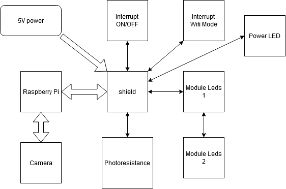
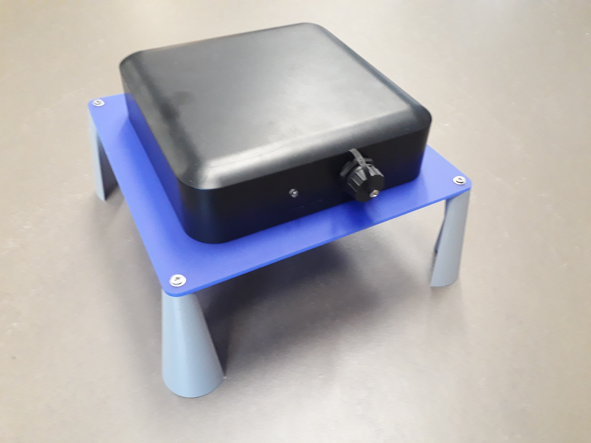
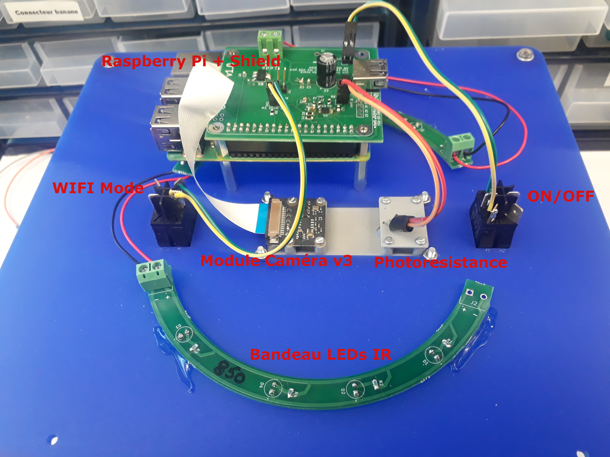
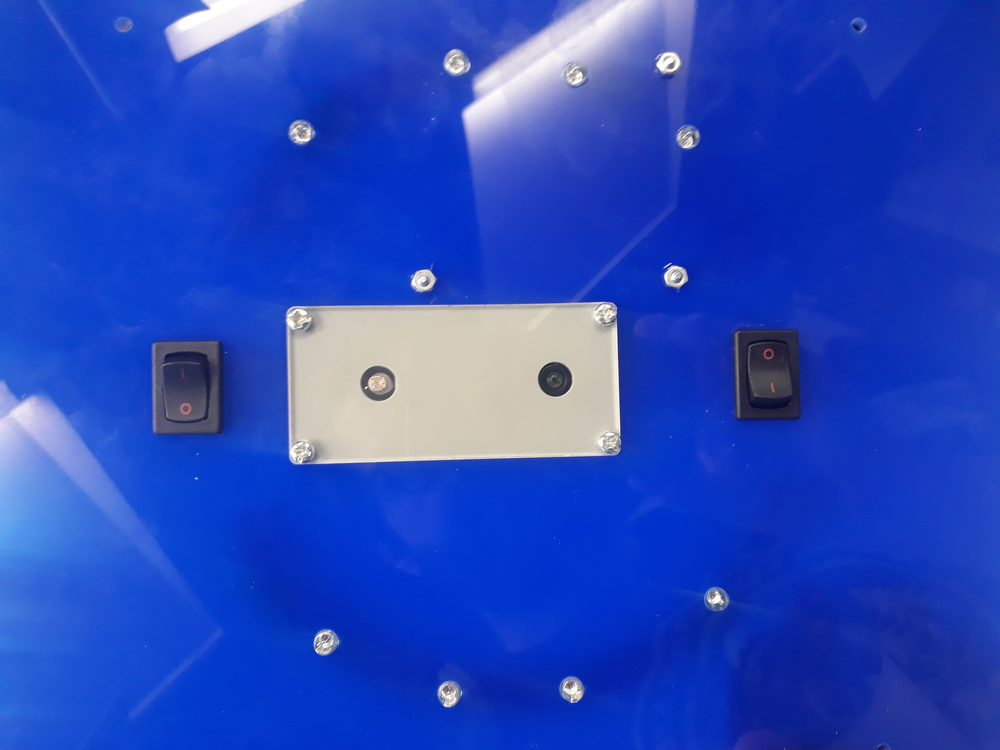

# CamTrap Hardware

Le CamTrap est organisé autour d'un Raspberry Pi.  
Il contient des parties imprimées en 3D et découpé au laser, cependant il est possible de faire sans.

## logiciels utilisés

Les PCBs ont été réalisés avec Kicad 7.0.
Les tracés laser avec Inkscape.

## Liste du Matériel

La liste du matériel se trouve dans le fichier "camtrap_bom.xlsx".

## Schéma de connection

## Liste des dossiers

Hardware  
├── camtrap/    
├── camtrap_usb_adapteur/  
├── camtrap3d/  
├── images/  
└── camtrap-leds/  

- **`camtrap`** : Contient les fichiers de fabrication de la carte head au dessus du Raspberry.  
- **`camtrap_usb_adapteur`** : Contient les fichiers de fabrication de la petite carte d'adaptation de la prise USB.  
- **`camtrap3d`** : Contient les fichiers d'impression et de découpe.  
- **`images`** : Contient les images pour le readme.  
- **`camtrap-leds`** :  Contient les fichiers de fabrication de la carte qui tient les leds

## Vue globale 

