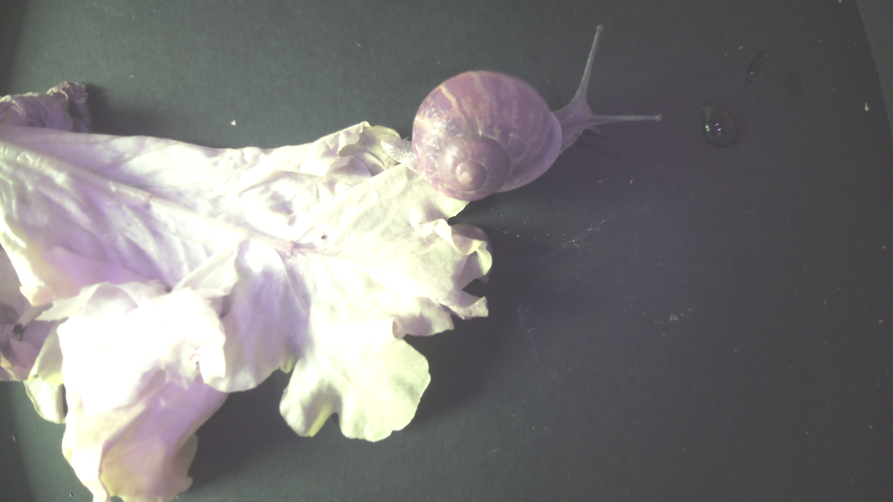
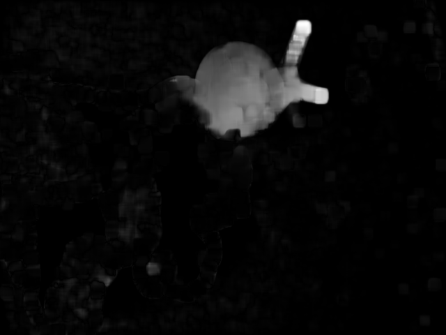

# BioSoilScop
The VerY cool Cam Trap for soil ORganisms (VYCTOR)

This camera trap was designed to study ground fauna without disturbing or killing it.

VYCTOR consists of a waterproof sensor measuring approximately 25x25cm with removable and interchangeable 10cm feet. It is capable of taking images day and night thanks to a brightness detection device that activates a night vision mode with 8 infrared LEDs surrounding the camera. The system is controlled by a Raspberry Pi. The camera films continuously at low resolution (without recording) and an algorithm detects movement by comparing images in pairs (background subtraction + speed calculation + shape detection). When movement is detected, a series of high-definition photos is taken at regular intervals and stored. The device is powered by mains electricity or battery. A computer interface allows the measurement settings to be configured and the characteristics of the installation site to be entered. It has been designed to be easy to use by non-specialists.

<ins>Picture of the VYCTOR device </ins>  

 ## Examples of pictures taken
Here are some images taken during a laboratory test session.

<ins>Taken picture of a snail after motion detection</ins>

<ins>Motion detection representation</ins>

<ins>Speed detection representation</ins>

## Construction
Browse the hardware folder to construct your VYCTOR

## Documentation
Recover the documentation user and developpement in the Folder Software

## Credit
This project was funded by the French national research agency (ANR) BISES ANR-19-CE 32-0012, the OSU OREME and the OSU Ecce Terra 

